# DocPilot — Multimodal RAG Assistant

> Upload any PDF. Ask questions. Get answers grounded in text, tables, and images.

---

## What It Does

DocPilot is a document intelligence assistant that understands all three content types inside a PDF — prose, tables, and figures — and answers natural language questions about them using GPT-4o.

---

## Pipeline



```
PDF Upload
    │
    ▼
[unstructured — fast strategy]
    ├── Text / NarrativeText / Title / ListItem ──► stored as-is
    ├── Table ──────────────────────────────────► GPT-4o summary
    └── Images (.jpg) ──────────────────────────► GPT-4o vision summary
                                │
                                ▼
                    [LangChain Documents]
                    page_content = summary
                    metadata     = {type, original_content}
                                │
                                ▼
                    [OpenAI Embeddings → FAISS]
                    1536-dim vectors, in-memory index
                                │
                    ── query time ──
                                │
                    User query
                                │
                                ▼
                    [FAISS similarity search — k=10]
                    Bi-encoder, fast but coarse
                                │
                                ▼
                    [CrossEncoder reranking — top 5]
                    ms-marco-TinyBERT, precise
                                │
                                ▼
                    [GPT-4o RAG chain]
                    Answer + relevant images rendered
```

---

## Tech Stack

| Layer | Technology | Version |
|-------|-----------|---------|
| UI | Streamlit | 1.58.0 |
| PDF Parsing | unstructured | 0.22.31 |
| OCR Engine | Tesseract | 5.5.0 |
| LLM + Vision | OpenAI GPT-4o | via openai 2.38.0 |
| Orchestration | LangChain | 1.3.2 |
| Embeddings | OpenAI text-embedding-ada-002 | via langchain-openai 1.2.2 |
| Vector DB | FAISS | 1.14.2 |
| Reranking | sentence-transformers CrossEncoder | 5.5.1 |

---

## Project Structure

```
DocPilot/
├── src/
│   ├── app.py                    # Main Streamlit application
│   ├── config.py                 # All constants and configuration
│   ├── utils/
│   │   ├── pdf_processor.py      # PDF extraction via unstructured
│   │   ├── document_handler.py   # LangChain Document creation
│   │   ├── vector_store.py       # FAISS vector store management
│   │   ├── reranker.py           # CrossEncoder reranking
│   │   └── encoding.py           # Image base64 utilities
│   └── prompts/
│       └── templates.py          # LLM prompt templates
├── .streamlit/
│   └── config.toml               # Dark theme, upload limits
├── uploads/                      # Temporary PDF storage (runtime)
├── raw_elements/                 # Extracted images (runtime)
├── debug_extraction.py           # Diagnostic script
├── requirements.txt              # Flexible dependencies
├── requirements-lock.txt         # Exact locked versions
├── .env.example                  # Environment variable template
└── .gitignore
```

---

## Local Setup (Windows)

### Prerequisites

**1. Tesseract OCR**
Download from https://github.com/UB-Mannheim/tesseract/wiki
Run installer, then add to PATH:
```powershell
[Environment]::SetEnvironmentVariable("Path", $env:Path + ";C:\Program Files\Tesseract-OCR", "User")
```
Restart PowerShell, verify: `tesseract --version`

**2. Poppler** (PDF rendering)
Download from https://github.com/oschwartz10612/poppler-windows/releases
Extract to `C:\poppler\`, add `C:\poppler\Library\bin` to PATH.
Verify: `pdfinfo --version`

### Install

```powershell
# Clone the repo
git clone https://github.com/<your-username>/docpilot.git
cd docpilot

# Create and activate virtual environment
python -m venv docpilot
.\docpilot\Scripts\Activate.ps1

# If activation is blocked by execution policy
Set-ExecutionPolicy -ExecutionPolicy RemoteSigned -Scope CurrentUser

# Install dependencies (use python -m pip, not bare pip)
python -m pip install -r requirements-lock.txt
```

### Configure

```powershell
copy .env.example .env
notepad .env
```

Add your OpenAI API key — no spaces, no quotes:
```
OPENAI_API_KEY=sk-proj-xxxxxxxxxxxxxxxxxxxxxxxx
```

### Run

```powershell
streamlit run src/app.py
```

Opens at http://localhost:8501

---

## Usage

1. Upload a PDF via the sidebar
2. Click **Process Document** — wait for all 4 steps
3. Ask questions in the chat
4. Relevant images are rendered alongside answers

**Best query types:**
- `What is the main finding of this paper?`
- `What BLEU scores were reported in the results?`
- `Describe the architecture diagram shown.`
- `What optimizer and learning rate schedule was used?`

---

## Known Limitations

| Limitation | Cause | Fix |
|-----------|-------|-----|
| Author names not extracted | pdfminer can't parse multi-column PDF headers | Switch to `ocr_only` strategy |
| Tables return 0 results | `fast` strategy has no spatial layout detection | Switch to `hi_res` (requires detectron2) |
| Query phrasing matters | Semantic gap between query and document embedding | Implement query expansion |
| Reprocessing required each session | FAISS index is in-memory only | Add FAISS index persistence to disk |

---

## Troubleshooting

| Error | Cause | Fix |
|-------|-------|-----|
| `scripts disabled` on activation | PowerShell execution policy | `Set-ExecutionPolicy RemoteSigned -Scope CurrentUser` |
| pip installs to wrong Python | Bare `pip` resolves to global | Use `python -m pip` always |
| `ModuleNotFoundError: src` | Streamlit adds `src/` to path, not root | Already fixed via `sys.path.insert` in app.py |
| `TesseractNotFoundError` after install | Stale terminal session | Close and reopen PowerShell |
| `TesseractNotFoundError` after restart | Library needs direct attribute | Set `unstructured_pytesseract.pytesseract.tesseract_cmd` |
| `unstructured_inference` not found | Separate package, not auto-installed | `python -m pip install unstructured-inference` |
| `pdf-image` extra not found | Extra renamed in unstructured 0.15+ | Use `unstructured[pdf,image]` |
| `0 elements extracted` | PDF not in uploads/ yet | Upload via app first, then debug |
| `Sorry, I don't have enough info` | Retrieval failure — content not in top-10 | Rephrase query or check debug_extraction.py |
| OpenAI `AuthenticationError` | Bad API key in .env | Check no spaces around `=` sign |

**Debug script** — run before the app to diagnose extraction:
```powershell
python debug_extraction.py
```

---

## Reproducing on Another Machine

```powershell
python -m venv docpilot
.\docpilot\Scripts\Activate.ps1
python -m pip install -r requirements-lock.txt
copy .env.example .env
# Add API key to .env
streamlit run src/app.py
```

---

